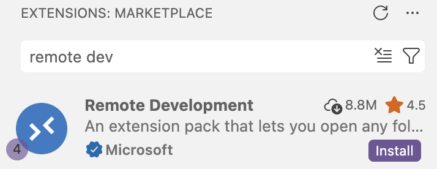

---------

<hr style="height:1pt; visibility:hidden;" />

## Introduction

In the rest of this workshop, we'll primarily use the following set of tools to
run code, access data, and make use of agentic AI tools:

1. A code editor, **VS Code**

2. A shared computing environment, **OSC** (the Ohio Supercomputer Center)

3. Generative and Agentic AI tools _integrated in our code editor_,
   **GitHub Copilot** and **Claude Code**

In this session, we will go through the necessary steps to get the first two components
configured in such a way that we can next proceed to using the AI tools. 

This same setup is what I use in my own work,
and you can continue using it after the workshop.
Getting this configured on your own computer is definitely a process,
but it is well worth it in my opinion.

::: callout-note
#### What about R?

Interested in using in-editor AI tools also for R during and/or after this workshop?

First off, for lightweight experimentation,
know that you can create and edit R scripts **right in VS Code**,
ask Copilot and Claude to help you write R code,
and run R code by starting R in the terminal.

However, for more extensive and interactive R (and Python!) usage,
the **Positron editor is the way to go**.
See the [Positron IDE setup instructions](./o3-positron-install.qmd) for details!
:::

## Exploring VS Code

### Introduction

VS Code is basically a **fancy text editor**.
To emphasize the additional functionality relative to basic text editors like Notepad,
editors like VS Code are also referred to as **IDEs**: Integrated Development Environments^[
The RStudio program is another good example of an IDE ---
and like RStudio is an IDE for R, VS Code will be our IDE for shell (and other) code.].

::: callout-tip
#### Why we use VS Code --- and why our own installation
It's a great editor all around, and when working at OSC in particular
---at least if you need to run command-line programs, and not just, say, R---
it's by far the most convenient and user-friendly way, in my opinion.

-----

You can also use VS Code at OSC in a web browser via OSC OnDemand,
like we did in the pre-workshop session.
That's nice because it requires no installation or other setup.
But in the long run, connecting your own VS Code installation to OSC is preferable.
In the context of this workshop,
**the primary reason we use our own VS Code installation is that because it allows us to use**
**the in-editor AI tools when connecting our own VS Code installation to OSC**
(this is not possible with the OnDemand version).
:::

You should have already installed VS Code (full name: Visual Studio Code) on your laptop.
Go ahead and open it.

{fig-align="center" width="75%" fig-alt="Screenshot of the VS Code icon on a Mac"}

### The VS Code User Interface

. In this example, multiple files are open in the editor pane (Editor Groups), and those have been split into two side-by-side groups.](/img/vscode-ui.png){fig-align="center" width="100%" fig-alt="An annotated screenshot of the VS Code user interace" .lightbox}

- The main part of the VS Code window is the **Editor Pane** (`C` above),
  where you can open and edit text files.

- The panel at the bottom (`D` above) contains a **terminal**, but isn't open by default.<br>
   In the top menu, click `Terminal` > `New Terminal` to open it.

- By default, the **Primary Side Bar** (`B` above) shows a file explorer,
  where you can see your files and create new ones, and so on.

- The **Activity Bar** (narrow side bar, `A` above) on the far left has:
  
  - Icons to toggle between options for the Primary Side Bar.
    For now, pay attention to the bottom one, Extensions, which we'll use soon.
  
  - A  (cog wheel icon) in the bottom, with two key options:
    - **Command Palette**, where you can access all VS Code functionality
    - **Settings**, where you can configure VS Code 

::: exercise
####  Exercises

1. In the cog wheel  menu, click `Themes` > `Color Theme`
   to explore VS Code color themes and optionally **change the color theme** to your liking.

2. You can **resize panes** by dragging the borders between them:
   try doing this with the Primary Side Bar and the Panel containing the terminal.
:::

## Setting up the OSC connection in VS Code

Now, we'll do some **one-time configuration** to enable connecting VS Code to OSC via so-called "SSH tunneling".
This process moves a VS Code window _entirely_ to OSC:
the terminal, the file system, the code editor, and so on^[
In case you're familiar with the `ssh` command, this is similar to connecting your terminal to OSC with `ssh <username>@cardinal.osc.edu`.
But instead of connecting just your terminal, this approach allows you to run the entire VS Code environment on OSC,
which has many benefits.
].

While it's most straightforward to set up a connection to an OSC **login node**,
we will additionally configure a connection to a **compute node**,
which is considerably more complicated.
However, this avoids clogging up OSC's login nodes,
and e.g. gives you more flexibility to test-run code in the terminal^[
Additionally, we will use a set up that will also work for the R IDE Positron,
which is a nice bonus.].

Once configured, this is a very convenient and powerful way to access OSC.

### Install the Remote Development extension

1. In the VS Code Activity Bar, click the **Extensions** icon at the bottom (left screenshot below).

:::: colummns
::: {.column width="43%"}
{fig-align="center" width="14%" fig-alt="Screenshot of the VS Code Activity Bar, showing the Extensions icon highlighted"}
:::

::: {.column width="51%"}
{fig-align="center" width="90%" fig-alt="Screenshot of the VS Code Remote Development extension"}
:::
::::

2. In the Extensions view that now shows up in the Primary (wide) Sidebar,
   **type "_remote dev_"** in the search box, and the 
   "[Remote Development](https://marketplace.visualstudio.com/items?itemName=ms-vscode-remote.vscode-remote-extensionpack)"
   extension should appear (right screenshot above).

4. Click the "**Install**" button to install this extension.

### Configure the OSC connection

Next, we'll use functionality from this extension pack to set up the connection to OSC:

4. Open the VS Code **Command Palette**
   (cog wheel  => Command Palette or <kbd>Ctrl/⌘</kbd>+<kbd>Shift</kbd>+<kbd>P</kbd>).
   
5. Type "_remote open_" and then:
   - Select the top option "**Remote-SSH: Open SSH Configuration File...**"
     (left screenshot below)
   - Again select the top option, a file that contains the username you have on your computer,
     and ends in `/.ssh/config` (right screenshot below):

:::: colummns
::: {.column width="48%"}
{fig-align="center" width="98%" fig-alt="Screenshot of the VS Code Command Palette, showing the 'Remote-SSH: Open SSHConfiguration File...' option   highlighted"}
:::
::: {.column width="3%"}
:::
::: {.column width="48%"}
{fig-align="center" width="85%" fig-alt="Screenshot of the VS Code Command Palette, showing the 'Remote-SSH: Open SSH Configuration File...' option  highlighted"}
:::
::::

6. Paste the following into the SSH configuration file that opens:

   ::: {.panel-tabset}
   
   ### Windows
   ::: {.callout-important appearance="simple"}
   These instructions are for Windows, click "Mac" above to see the Mac instructions.
   :::

   ```markdown
   Host osc-cardinal-login
       User <osc-username>
       HostName cardinal.osc.edu

   Host osc-cardinal-compute
       User <osc-username>
       ForwardAgent yes
       StrictHostKeyChecking no
       UserKnownHostsFile=/dev/null
       ConnectTimeout 120
       ProxyCommand C:/Users/<computer-username>/.ssh/osc-compute-proxy.cmd %h
   ```

   ### Mac

   ```markdown
   Host osc-cardinal-login
       User <osc-username>
       HostName cardinal.osc.edu

   Host osc-cardinal-compute
       User <osc-username>
       ForwardAgent yes
       StrictHostKeyChecking no
       UserKnownHostsFile=/dev/null
       ConnectTimeout 120
       ProxyCommand /Users/<computer-username>/.ssh/osc-compute-proxy.sh %h
   ```

   :::

8. Edit this SSH configuration file to replace the placeholders with your own information:

   - In both instances, change `User <osc-username>` to your **OSC username**,
     e.g to `User jane`.

   - Change `<computer-username>` to your **username on your computer**
     (the same one that appears in the file path at the top of the config file^[
        If you have an OSU-managed computer this will be you `name.#`.
        If you have you own computer, you likely picked your username yourself.
     ]), e.g. to `miller.103`.

   Then, save the changes you made to the file
   (`File` > `Save` or <kbd>Ctrl/⌘</kbd>+<kbd>S</kbd>).

7. In the file above, the first connection (`osc-cardinal-login`) is to a login node.
   The second (`osc-cardinal-compute`) is to a compute node,
   and it refers to a "proxy script" we will create now.
   In the VS Code terminal that you opened earlier, copy-and-paste and then execute
   the following command as-is:

   ::: {.panel-tabset}
   ### Windows
   
   ::: {.callout-important appearance="simple"}
   These instructions are for Windows, click "Mac" above to see the Mac instructions.

   They also assume you are using PowerShell, which is the default Windows shell in VS Code.
   If you are using a Unix shell via Git Bash or another mechanism,
   you should use the Mac instructions instead.
   :::

   ```powershell
   @"
   @echo off
   ssh -o LogLevel=QUIET -o BatchMode=yes osc-cardinal-login "/usr/bin/salloc -A PAS3454 -t 300 /bin/bash -c 'nc $SLURM_NODELIST 22'"
   "@ | Out-File -Encoding ascii "$env:USERPROFILE\.ssh\osc-compute-proxy.cmd"
   ```

   ### Mac

   ```bash
   cat > ~/.ssh/osc-compute-proxy.sh << 'EOF'
   #!/bin/bash
   exec ssh -o LogLevel=QUIET -o BatchMode=yes osc-cardinal-login \
     "/usr/bin/salloc -A PAS3454 -t 300 /bin/bash -c 'nc \$SLURM_NODELIST 22'" 2>/dev/null
   EOF
   
   chmod +x ~/.ssh/osc-compute-proxy.sh
   ```
   :::

8. Because connecting to a compute node may take a while to establish, we also
   need to increase the "connection timeout".
   Open the VS Code **Settings** (cog wheel  => Settings) and search for `remote.SSH.connectTimeout`.
   Change the value from 15 to **300** (seconds).

{fig-align="center" width="95%" fig-alt="Screenshot of the VS Code Settings, showing the 'Remote.SSH: Connect Timeout' option highlighted"}

::: {.callout-note collapse="true"}
#### Recap and more info about what we just did _(Click to expand)_

In the SSH configuration file, we defined two remote "hosts" that we can connect to:

- `osc-cardinal`, which will connect to a **login node** of OSC's Cardinal cluster.
  However, because the VS Code program will actually run on the login node when
  you connect it with SSH-tunneling, the below connection to a compute node is preferred.

- `osc-cardinal-compute` will connect to a **compute node** of OSC's Cardinal cluster.
  We can't connect directly to a compute node but have to request a compute job,
  which is why that connection is more complicated.
  This connection will last for 5 hours (300 minutes),
  as it requests a compute job of that duration.

The proxy script handles the compute job submission and connection to the allocated
compute node. We use a script rather than a much simpler inline command so that the
configuration works with both VS Code and [Positron (for R)](./o3-positron-install.qmd).

Because compute jobs (for `osc-cardinal-compute`) may take a while to start,
we also increased the "connection timeout"
(amount of time VS Code will wait for the connection to be established) to 5 minutes.
:::

::: {.callout-warning collapse="true"}
#### For after the workshop: Changing the account to be charged for compute time _(Click to expand)_
The `-A PAS3454` part of the connection instructs OSC to charge the compute time
to the workshop's OSC Project.
While it's OK to keep using this for a bit after the workshop ---
if you have access to another OSC project, you should change `PAS3454` to that project's number.
:::

::: {.callout-tip}
#### Connecting to other OSC clusters
To configure connect to other OSC clusters (currently, Pitzer and Ascend),
you can add additional entries to this SSH configuration file,
simply replacing `cardinal` by the name of the other cluster.
:::

### Configuration so you won't have to enter your OSC password

The following steps will prevent OSC from prompting you for your OSC password every
time you connect to OSC via SSH --- it will use an SSH key pair for authentication instead.
This is convenient when it comes to login node connections,
and simply necessary for the compute node connection we configured.

10. In the terminal you should have open in VS Code
    (_regardless of whether you're using Windows or Mac_),
    execute the following command to generate a SSH key-pair:

    ``` {.bash}
    ssh-keygen -t rsa
    ```

11. You will be asked several questions, and in each case,
    **simply press <kbd>Enter</kbd> to accept the default answer** ---
    do this until you see some curious-looking artful output,
    and get your command prompt back.

12. Excute the following command to transfer the public key to OSC's Cardinal cluster,
    **replacing `<user>` with your OSC username**:

    ::: {.panel-tabset}
    ### Windows
    ::: {.callout-important appearance="simple"}
    These instructions are for Windows, click "Mac" above to see the Mac instructions.
    :::
   
    ```bash
    # Replace <user> by your username, e.g. "jelmer@cardinal.osc.edu"
    cat ~/.ssh/id_rsa.pub | ssh <user>@cardinal.osc.edu 'mkdir -p .ssh && cat >> .ssh/authorized_keys'
    ```
   
    ### Mac
    ```bash
    # Replace <user> by your username, e.g. "jelmer@cardinal.osc.edu"
    ssh-copy-id <user>@cardinal.osc.edu
    ```
    :::

13. You should be prompted for your password: enter it.

Congratulations on making it this far! Let's now test the connection.

## Connecting VS Code to OSC

### Connect to OSC

With the one-time configuration steps done, you should from now on be able to 
connect to OSC like so:

1. Open the Command Palette
   (cog wheel  => Command Palette or <kbd>Ctrl/⌘</kbd>+<kbd>Shift</kbd>+<kbd>P</kbd>).

2. Start typing "_**SSH connect**_", click on `SSH: Connect to Host`,

3. Select the second of the connections you just set up, `osc-cardinal-compute`:

   {fig-align="center" width="60%" fig-alt="Screenshot of the VS Code Command Palette, showing the 'SSH: Connect to Host' option highlighted"}

3. A new VS Code window will open. 
   The connection may take a little while (typically 5–30 seconds, could be longer if you're unlucky)
   to establish, because a compute job has to be requested, assigned resources, and started.
   In the bottom right, you should see something like the following while it is connecting:

   {fig-align="center" width="60%" fig-alt="Screenshot of the VS Code window while connecting to the remote host"}
   
5. Once connected, the following pop-up likely appears: click "_Trust Folder and Continue_".

   {fig-align="center" width="60%" fig-alt="Screenshot of the VS Code pop-up asking whether to trust the authors of the folder you ended up in, with the 'Trust and Continue' button highlighted"}

   ::: {.callout-important appearance="simple"}
   If the connection fails or takes more than a minute to establish, ask us for troubleshooting help.
   As a last resort, try connecting to the login node connection `osc-cardinal-login` instead. 
   :::

### Open a folder on OSC

VS Code takes a specific
**folder as a starting point in all parts of the program**:
in its file explorer, in the terminal, when saving files, and so on.
By default, this folder is your Home directory.
But in this workshop, we'll only work in a folder specific to the workshop,
so let's open that one now.

 Click `Open...` with a folder icon in the Welcome document
(or: `File` > `Open Folder`) and then enter and select `/fs/scratch/PAS3454`.

{fig-align="center" width="45%" fig-alt="Screenshot of the VS Code Welcome document, showing the 'Open Folder...' button highlighted"}

This will cause the program to reload, and the "trust popup" will appear again^[
for this folder, it won't appear again in the future, once you've trusted it.].
In the File Explorer, you should now see folders `data`, `people`, and `share`:

{fig-align="center" width="40%" fig-alt="Screenshot of the VS Code file explorer, showing the 'people', 'data', and 'share' folders in the /fs/scratch/PAS3454 folder"}

::: exercise
####  Create your own folder on OSC

**_This is only necessary if you didn't do the pre-workshop learning,_**
**_in which you created this folder._**

Create a dir `/fs/scratch/PAS3454/people/<user>`,
where `<user>` should be your exact OSC username.

<details><summary>Click to see some hints</summary>

You can create this dir in several ways, but here is the most bulletproof one:

```bash
# `$USER` is an environment variable that contains your username,
# so this exact command will work for everyone:
mkdir /fs/scratch/PAS3454/people/$USER
```
   
Alternatively, assuming you are in `/fs/scratch/PAS3454` and your username is
`jane`, a simpler command would be:

```bash
mkdir people/jane
```

Other alternatives include using the VS Code file explorer (there's a "New Folder" button)
or the [OSC OnDemand](https://ondemand.osc.edu/) file browser.

</details>
:::

::: {.callout-tip collapse="false"}
#### From now on: Connecting directly to a specific folder at OSC

The above two-step procedure (connect to OSC, then open a folder) can be done
in one even simpler step, after you've connected to that folder at least once:

Once you re-open VS Code (or open a new window with `File` > `New Window`),
the `Recent` section in the VS Code "Welcome" document will now show the folder(s)
you previously opened:

{fig-align="center" width="40%" fig-alt="Screenshot of the VS Code Welcome document, showing the 'Recents' section with the 'Open Folder...' button highlighted"}

Simply clicking on that line will open that folder and in the process connect to OSC!
:::

::: {.callout-note collapse="true"}
### Optional: useful VS Code settings _(Click to expand)_

Here are some miscellaneous settings that you may want to change in VS Code.

To change any of these, start by opening the VS Code **Settings** (cog wheel  > `Settings`).
Then, search for the following settings to change them:

- You can turn on auto-save for files in the editor, which I like.
  Search "**auto save**" and select the option you prefer --- I use `afterDelay`.
  
  {fig-align="center" width="70%" fig-alt="Screenshot of the VS Code Settings, showing the 'Files: Auto Save' option highlighted"}

- Turn off "Sticky Scroll" in the terminal.
  This is a newish feature that, as far as I can tell, seems to malfunction and
  can be really annoying: it will e.g. regularly hide the line you just executed.
  Search for "**terminal sticky**" and uncheck the box:

{fig-align="center" width="95%" fig-alt="Screenshot of the VS Code Settings, showing the 'Terminal > Integrated: Sticky Scroll' option highlighted"}

- I also think the so-called "Minimap", which shows a small overview of a file in the editor pane,
  is uninformative and takes up space.
  Search for the option `editor.minimap.enabled` and turn it off.

:::
