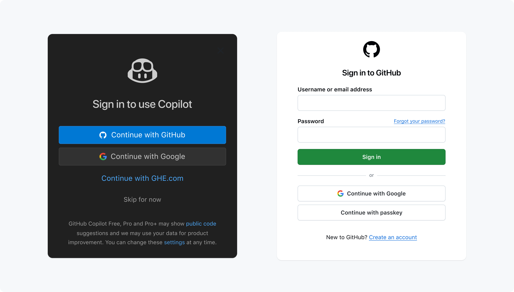

---------

<hr style="height:1pt; visibility:hidden;" />

::: {.callout-caution appearance="simple"}
**_This page is still subject to change_**
:::

<hr style="height:1pt; visibility:hidden;" />

## Overview

In the rest of this workshop, we'll primarily use the following set of tools to
enable us to run code, access data, and deploy agentic AI tools:

- **VS Code**: a code editor that we'll use to write and run code
- **GitHub Copilot** and **Claude Code**, in the form of plugins for VS Code,
  for generative and agentic AI access
- **OSC**: the Ohio Supercomputer Center, which will provide us with a powerful shared computing environment
  and access to data

This same setup is what the instructors use in their own work,
and it is a setup that you can continue to use after the workshop
(with some caveats regarding the AI tools, which we'll discuss).

## Some VS Code exploration

VS Code is basically a **fancy text editor**.
Its full name is Visual Studio Code, and it's called "Code Server" at OSC.

To emphasize the additional functionality relative to basic text editors like Notepad and TextEdit,
editors like VS Code are also referred to as **IDEs**: Integrated Development Environments.
The RStudio program is another good example of an IDE ---
and like RStudio is an IDE for R, VS Code will be our IDE for shell (and other) code.

### The VS Code User Interface

{fig-align="center" width="80%" fig-alt="An annotated screenshot of the VS Code user interace" .lightbox}

#### Side bars

By default, the (wide) **Side Bar** will show a file explorer,
where you see your files, create new folders and files, and so on.

The **Activity Bar** (narrow side bar) on the far left has:

- A  ("hamburger menu"),
  which has menu items like `File` that you often find in a top bar
- A  (cog wheel icon) in the bottom,
  through which you can mainly access *settings*
- Icons to toggle between options for the wide Side Bar:
  we'll talk about those in a later session
  
### A folder as a starting point

Very conveniently, VS Code takes a specific
**folder as a starting point in all parts of the program**:

- In its file explorer
- When saving files
- In the Unix shell its terminal

 Click `File` > `Open Folder` and then type/select the
personal dir within `/fs/ess/PAS3454/users` you made last week
(for example, I will select `/fs/ess/PAS3454/users/jelmer`).
_This will cause the program to reload._

#### Terminal (with a Unix shell)

 **Open a terminal** by clicking
   > `Terminal` > `New Terminal`.
We'll start using this terminal in the next lecture.
For now, practice _resizing panes_
(terminal vs. editor, and the width of the side bar)
by hovering your cursor over the lines dividing them and then dragging.

#### Editor pane and `Welcome` document

The main part of the VS Code is the **editor pane**.
Here, you can open scripts and other types of text files, images, and so on.
Like in a web browser, you can have multiple tabs open.

Whenever you open VS Code,
an editor tab with a `Welcome` document is automatically opened.
This provides some help and shortcuts to recently opened files and folders.

## A first dive: GitHub Copilot

GitHub Copilot is an agentic AI tool that can help you write code and perform other tasks.
Among other things, it is available as a pre-installed plugin for VS Code.
While this is a Microsoft product, it is not one you can –currently– use institutionally at OSU.
Instead, access runs through a personal GitHub account,
which you can create for free and which you can use for other purposes as well.

When you open VS Code, you should see **XXXX** login button to log into GitHub.
For those without a GitHub account, you can create one on the fly,
including semi-automatically via a Google login if you have a Google account.

{fig-align="center" width="80%"}

Unless you had previously set up GitHub Pro access,
you will now be automatically using the Free Tier of GitHub Copilot.
This free tier is not sufficient for sustained use of GitHub Copilot,
but is sufficient for the purposes of this workshop,
especially because you also have access to Claude Code (which we will set up later).

- TBA - Question in the chat

- TBA - Inline code example

## Connect VS Code to OSC

Next, we will set up VS Code to connect to OSC.
This one-time setup is a bit of a process, but is well worth it.
This so-called "SSH tunneling" of VS Code is a very convenient and powerful way to
access OSC,
with or without the added benefit of agentic AI tools.
It will move a VS Code window entirely to OSC -
not just the terminal, but also the file system, the code editor, and so on.

1. Open VS Code on your laptop

2. In the narrow sidebar on the left, click the square icon with four squares inside it (the "Extensions" icon),
   and now, the wide sidebar on the left will show a search box at the top and a list of extensions below it

3. In the search box, type "Remote Development" and you should see the 
   "[Remote Development extension pack](https://marketplace.visualstudio.com/items?itemName=ms-vscode-remote.vscode-remote-extensionpack)"
   appear

4. Click the "Install" button to install this extension pack

Now, we will use functionality from this extension pack to connect to OSC:

5. Open the VS Code Command Palette by pressing
   <kbd>Ctrl/⌘</kbd>+<kbd>Shift</kbd>+<kbd>P</kbd>)
   and start typing "_Remote SSH_":
   
   - Among the options that pop up, select "**Remote-SSH: Add New SSH Host...**"
     and type the following, replacing `<osc-username>` with your OSC username:

     ```bash
     ssh <osc-username>@cardinal.osc.edu
     ```

     For example, if your username is `marie`, you would type:

     ```bash
     ssh marie@cardinal.osc.edu 
     ```
   
   - In the dialog "**Select SSH configuration file to update**" that pops up,
     select the first (top) option

4. You'll see a "**Host Added!**" pop-up (may be in the bottom-right of your screen):
   in that pop-up, click "**Connect**", and:

   - When you get a message like that shown below, click "Continue":
   
     > "cardinal.osc.edu" has fingerprint <...>   
     > Are you sure you want to continue?
   
   - Enter your **OSC password** when you're prompted for it
   - If you're asked about the operating system of the host, select **Linux**

5. Now, you're connected, most likely in a new VS Code window,
   and some more pop-ups may appear:

   - If you're asked whether you "Trust the Authors" of the folder you ended up in,
     click "Yes"
   - If a pop-up in the bottom-right asks you to update Git,
     click "No" and check "Don't show again"

8. **Open a folder**

9. Close the window?

::: callout-tip
#### Connecting from now on

With the above one-time setup done,
connecting to OSC with your local VS Code installation will be quick:

1. Open the Command Palette and start typing "_SSH Connect_"
   
2. Click on "SSH: Connect to Host" and then select your OSC connection

3. Enter your password
   _(but this won't be necessary anymore after you do the below setup!)_

Also, any previously opened folders on OSC will....TBA

:::

::: {.callout-note collapse="true"}

### Optional setup so you won't have to enter your OSC password again _(Click to expand)_

If you take the following steps,
you will no longer be prompted for your OSC password every time you connect to OSC
with the above method (or with any other SSH-based method).

1. On your own computer, open a terminal application.
   - On a Mac, you should have an app called "Terminal" and potentially other
     options like "iTerm": any of these fill work
   - On Windows 11+, this should be called the "Windows Terminal"

2.  Generate a public-private SSH key-pair:

    ``` {.bash}
    ssh-keygen -t rsa
    ```

    You'll get some output and will then be asked several questions,
    but in each case, you can just press <kbd>Enter</kbd> to select the default answer.

3. Transfer the public key to OSC's Cardinal cluster:

   ::: {.panel-tabset}
   ### Windows
  
   ```bash
   cat ~/.ssh/id_rsa.pub | ssh <user>@cardinal.osc.edu 'mkdir -p .ssh && cat >> .ssh/authorized_keys'
   ```
  
   ### Mac
   ```bash
   # Replace <user> by your username, e.g. "ssh-copy-id jelmer@cardinal.osc.edu"
   ssh-copy-id <user>@cardinal.osc.edu
   ```
   :::

4. All done! Test if it works by connecting

:::

## Install and set up Claude Code

1. In the Extensions sidebar of VS Code, search for "Claude Code" and install the extension
   "[Claude Code for VS Code](https://marketplace.visualstudio.com/items?itemName=anthropic.claude-code)"

2. TBA

<hr style="height:1pt; visibility:hidden;" />
