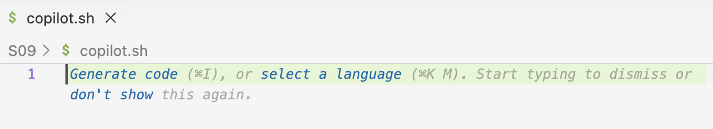

---------

<hr style="height:1pt; visibility:hidden;" />

::: {.callout-caution appearance="simple"}
**_This page is still subject to change_**
:::

<hr style="height:1pt; visibility:hidden;" />

## Introduction

In this session, we'll start using the AI tools Claude Code and GitHub Copilot,
while connected to OSC in VS Code.

These tools are quite similar.
But we'll **focus on Claude Code** because the workshop has usage credits for this tool,
and we're using it in a way that has approval for use with institutional data.
Therefore, you can use it also with your own data tomorrow afternoon,
even if that's sensitive data that cannot be shared publicly.

But we'll **start with GitHub Copilot**,
which provides a nice feature that Claude Code does not have:
it can generate code _directly_ in your VS Code editor,
providing suggestions as you type your text and code.

::: exercise
####  Setting up

1. You should still have an active session in VS Code connected to OSC.
   If not, start a new session. 

   <details><summary>Instructions to start a new session</summary>

   1. Open VS Code, or if you already have a window open that's not connected to OSC,
   open a new VS Code window with `File` > `New Window`.

   2. In the `Recent` section in the VS Code "Welcome" document,
   you should see the `PAS3454` OSC folder with the `osc-cardinal-compute` connection ---
   click on that line to open that folder and in the process connect to OSC!

   {fig-align="center" width="40%" fig-alt="Screenshot of the VS Code Welcome document, showing the 'Recents' section with the 'Open Folder...' button highlighted"}

   If you don't see the `PAS3454` OSC folder in the `Recent` section after Step 1,
   simply start a new session, for example like so:

   2. Click the `Connect to...` button in the "Welcome" document
   (also visible in the screenshot above),
   and select the `osc-cardinal-compute` connection.

   </details>

2. Once connected to OSC, click `File` > `Open Folder...`,
   and select the folder `/fs/scratch/PAS3454/people/<user>`.

3. Open a terminal and make sure you are in dir `/fs/scratch/PAS3454/people/<user>`:
   
   ```bash
   pwd
   ```
   ```bash-out
   /fs/scratch/PAS3454/people/jane
   ```

   If not, redo step 2! The terminal will automatically start in the folder you opened in VS Code.

3. Copy a shared data dir to your own dir:

   ```bash
   # After this, the data will be in `/fs/scratch/PAS3454/people/<user>/iqbal`
   cp -rv /fs/scratch/PAS3454/data/iqbal .
   ```
   ```bash-out
   '/fs/scratch/PAS3454/data/iqbal' -> './iqbal'
   '/fs/scratch/PAS3454/data/iqbal/ref' -> './iqbal/ref'
   '/fs/scratch/PAS3454/data/iqbal/ref/GCA_000004655.2_ASM465v1_genomic.fna' -> './iqbal/ref/GCA_000004655.2_ASM465v1_genomic.fna'
   '/fs/scratch/PAS3454/data/iqbal/ref/GCA_000004655.2_ASM465v1_genomic.gff' -> './iqbal/ref/GCA_000004655.2_ASM465v1_genomic.gff'
   '/fs/scratch/PAS3454/data/iqbal/meta.tsv' -> './iqbal/meta.tsv'
   '/fs/scratch/PAS3454/data/iqbal/README.md' -> './iqbal/README.md'
   '/fs/scratch/PAS3454/data/iqbal/fastq' -> './iqbal/fastq'
   '/fs/scratch/PAS3454/data/iqbal/fastq/SRR31869592_2.fastq.gz' -> './iqbal/fastq/SRR31869592_2.fastq.gz'
   '/fs/scratch/PAS3454/data/iqbal/fastq/SRR31869601_2.fastq.gz' -> './iqbal/fastq/SRR31869601_2.fastq.gz'
   '/fs/scratch/PAS3454/data/iqbal/fastq/SRR31869592_1.fastq.gz' -> './iqbal/fastq/SRR31869592_1.fastq.gz'
   # [...output truncated...]
   ```

   ::: {.callout-tip appearance="simple"}
   We're trying to mimic a situation where you have a self-contained research project dir,
   because:

   - Our genAI tools won't see files outside of your VS Code-opened dir!
   - Having a single dir (with subdirs) with all your files,
     rather than files scattered around the file system [☠️]{style="font-size: 1.2em;"},
     or files from different projects mixed together [☠️]{style="font-size: 1.2em;"},
     is also good practice for reproducible research.
   :::

4. Create a new dir `S07` (as in: session 7) within your `/fs/scratch/PAS3454/people/<user>` dir:

   ```bash
   mkdir S07
   ```

5. Run the `tree` command to understand the current structure of your dirs and files:

   ```bash
   tree
   ```
   ```bash-out
    .
    ├── S9
    ├── iqbal
    │   ├── README.md
    │   ├── fastq
    │   │   ├── SRR31869590_1.fastq.gz
    │   │   ├── SRR31869590_2.fastq.gz
    │   │   ├── SRR31869591_1.fastq.gz
    │   │   ├── SRR31869591_2.fastq.gz
    │   │   ├── [...output truncated...] 
    │   ├── meta.tsv
    │   └── ref
    │       ├── GCA_000004655.2_ASM465v1_genomic.fna
    │       └── GCA_000004655.2_ASM465v1_genomic.gff
   ```
:::

## Code completions with GitHub Copilot

"[Code completions](https://docs.github.com/en/copilot/how-tos/get-code-suggestions/get-ide-code-suggestions)",
also known as "code suggestions" or "inline suggestions",
are a feature of GitHub Copilot where you get suggestions for additional
or modified code ---or other text--- as you type in your VS Code editor.
There are two types of code completions, and we'll go over these one by one.

### Ghost text suggestions

Ghost text suggestions are the most common type of code completions.
As you type, GitHub Copilot will provide suggestions in a light gray font,
which you can accept by pressing the <kbd>Tab</kbd> key.
We may think of ghost text suggestions as in turn consisting of two types of suggestions:

#### Suggestions that try to complete a line you are typing

Similarly, they may suggest a next line based on the previous one.
For example, if you type `#!` as the first line of a shell script,
GitHub Copilot is likely to suggest the full shebang line `#!/bin/bash` for you:

{fig-align="center" width="45%" fig-alt="Ghost text suggestions in GitHub Copilot" .lightbox}

#### Suggestions based on a code comment you have written

These try to generate code that implements what you described in the comment.
For example, if you write a comment ``# Count the number of dirs in `people` ``
in a shell script, press <kbd>Enter</kbd>, and wait a second,
Copilot should suggest something like this:
   
{fig-align="center" width="60%" fig-alt="Ghost text suggestions in GitHub Copilot" .lightbox}

Requesting these kinds of suggestions is similar to asking a question
in the Copilot chat window,
but is faster and more convenient (and cheaper) for small items,
while not as suitable for more complex questions.

::: exercise
####  Exercise: Try it yourself

1. Open a new file in VS Code, and save it as `S07/copilot.sh`.

   <details><summary>Instructions to create a new file</summary>
   There are a number of ways you can do this, including:
   
   - `File` > `New File`, then `File` > `Save As...`

   - Execute the command `touch S07/copilot.sh`,
     then hold <kbd>Ctrl/⌘</kbd> and click on the file name in the terminal to open it ---
     the latter is a useful trick more generally.
   </details>

   ::: {.callout-note appearance="simple"}
   You should immediately see the following, which is also a ghost text suggestion,
   in your new file.
   For now, ignore that --- when you start to type it will disappear.

   {fig-align="center" width="100%" fig-alt="Screenshot of Copilot ghost text when you open a new shell file"}
   :::

2. Like above, try to get a ghost text suggestion for a shebang line by typing `#!` as the first line.

3. Press <kbd>Enter</kbd> twice, and wait for a bit.
   Copilot should start guessing what the script is about (most of all, based on the file name),
   and provide the kind of comment often added to the top of a script to describe what it does.
   For example:

   {fig-align="center" width="90%" fig-alt="Screenshot of Copilot ghost text when you open a new shell file"}

   It can be fun or even useful to go down that rabbit hole (you can keep pressing <kbd>Enter</kbd> to get more suggestions!),
   but here, we will ignore that.

4. Like above, try to get a ghost text suggestion for a code comment by using the comment:
   ``# Count the number of dirs in `people` ``.

5. Think of a few questions of your own
   that you could ask Copilot in a code comment, and try them out.
   You can also play around with trying to get suggestions for code that you are typing.

::: {.callout-tip appearance="simple"}
For all code completions, pressing <kbd>Tab</kbd> will accept the suggestion,
while <kbd>Esc</kbd> will explcitly dismiss it.
You can also implicitly dismiss a suggestion by continuing to type.
:::
:::

<hr style="height:1pt; visibility:hidden;" />

### Next edit suggestions

["Next edit" suggestions](https://code.visualstudio.com/docs/editing/ai-powered-suggestions#_next-edit-suggestions)
will suggest a modification to code or other text you have already written.
A number of scenarios can trigger next edit suggestions, such as:

- Syntax, spelling, or style errors in your code (e.g., a missing closing bracket or quote)
- When you change one instance of a recurring pattern in your code (e.g., a variable name or a path),
  it will suggest to change the other instances as well.

As a very simple example, if you type the incorrect `Ls -lh` in your `S07/copilot.sh` file,
and wait a second, Copilot will suggest to change it to `ls -lh` (with a lowercase `l`):

{fig-align="center" width="35%" fig-alt="Screenshot of Copilot next edit suggestion for syntax error"}

As an example of the second scenario, consider the following code,
which runs three commands to get information about the `people` dir and its contents:

```bash
# Count the number of dirs
find people -type d | wc -l

# List all files and dirs (non-recursively)
ls -lh people

# Get the total size of the `people` dir and its contents (recursively)
du -sh people
```

If you change the first instance of `people` to `data`,
Copilot will suggest to change the other instances as well:

{fig-align="center" width="50%" fig-alt="Screenshot of Copilot next edit suggestion for recurring pattern"}

You'll press <kbd>Tab</kbd> to accept a suggestion, and <kbd>Tab</kbd> to move on to the next suggestion,
and <kbd>Tab</kbd> again to accept that one, and so on:

{fig-align="center" width="50%" fig-alt="Screenshot of Copilot next edit suggestion for recurring pattern"}

These types of suggestions are sometimes off-target
(e.g., maybe you don't want to change the other instances of `people` to `data`!),
but in my experience, they are often quite useful and not just a time-saver,
but also a way to avoid mistakes (e.g., forgetting to change one of the instances).

### Related: Inline chat

While technically (and importantly, for billing) part of the GitHub Copilot Chat features,
a final inline Copilot feature is "**inline chat**".

It can be used more broadly, but here, we'll just show a feature that dovetails
best with code completions: selecting a piece of code and ask Copilot to modify
(or explain) it.

#### Modify code

1. In your `S07/copilot.sh` file, select the line that counts the number of dirs in `people`,
   and press <kbd>Ctrl/⌘</kbd> + <kbd>I</kbd>.
   The inline chat window should open as follows:

   {fig-align="center" width="38%" fig-alt="Screenshot of Copilot inline chat feature, showing a code snippet and the 'Chat about this code' option in the context menu"}

2. Then, in the little chat window, you can ask Copilot to modify the code,
   for example to count not in the `people` dir but in the current dir:

   {fig-align="center" width="38%" fig-alt="Screenshot of Copilot inline chat feature, showing a code snippet and the 'Chat about this code' option in the context menu"}

3. Press <kbd>Enter</kbd> to send the request, and Copilot will provide a suggestion in the chat window:

   {fig-align="center" width="75%" fig-alt="Screenshot of Copilot inline chat feature, showing a code snippet and the 'Chat about this code' option in the context menu"}
    
   The above so-called "diff" (as in difference) view with the duplicated line
   may be a bit confusing at first^[
   But should be familiar to those of you using version control!],
   but is really neat and informative once you get used to it:
   the [red-highlighted]{style="background-color: #ffcccc;"} line in the
   chat window is the original code you selected, while the
   [green-highlighted]{style="background-color: #ccffcc;"}
   line below it is the suggested modified code.

4. Click `Keep` to accept the suggestion, which is correct in the example above.

::: {.callout-tip appearance="simple"}
Inline chat also works in the Terminal: when you type something in the terminal
and press <kbd>Ctrl/⌘</kbd> + <kbd>I</kbd>, the inline chat window will open
there and operate on the command you typed in the terminal.
:::

#### Explain code

Until recently, the inline chat feature would by default start by having you choose
whether you want to modify or explain code.
The explain option is still available,
but now you have to explicitly ask for it with a so-called "slash command"
(we'll talk more about slash commands in the Claude section) ---
type `/explain` and press <kbd>Enter</kbd>:

{fig-align="center" width="80%" fig-alt="Screenshot of Copilot inline chat feature, showing a code snippet and the 'Chat about this code' option in the context menu"}

You should get a response similar to the following:

{fig-align="center" width="80%" fig-alt="Screenshot of Copilot inline chat feature, showing a code snippet and the 'Chat about this code' option in the context menu"}

-----

::: {.callout-warning appearance="simple"}
As mentioned above, inline chat is technically part of the Copilot chat rather
than code completions features --- including for credit usage purposes.
In Copilot Student and Copilot Pro (for teacher) plans,
unlimited code completions are included (!), but this is not true for chat features.
:::

::: {.callout-tip appearance="simple"}
If you use code completion features within your code and documentation files,
you are not exposing any internal data you may have elsewhere in the dir hierarchy
that you have open in VS Code.
:::

::: {.callout-note collapse="true"}
#### How to check your Copilot usage stats
You can see what Copilot plan you have and what your usage stats for the current
calendar month are by clicking the GitHub Copilot icon in the bottom right of your VS Code window:

{fig-align="center" width="20%" fig-alt="Screenshot of the GitHub Copilot icon in the bottom right of the VS Code window"}

A small window will pop up.
For example, my screenshot below shows I'm on the Pro plan and have used 17% of
available credits (i.e., for chat features) for this month.
Because inline suggestions are unlimited, they are simply listed as "Enabled":

{fig-align="center" width="40%" fig-alt="Screenshot of Copilot usage stats"}

Credit usage for individual chat requests can be seen in the chat window itself,
such as in the example chat in the previous session:

{fig-align="center" width="70%" fig-alt="Screenshot of the GitHub Copilot prompt showing the answer to the question about how many reads are in the specified fastq file"}

See also the VS Code / GitHub Copilot docs on
[optimizing credit usage](https://code.visualstudio.com/docs/agents/guides/optimize-usage).
:::

### Practice

::: exercise
####  Exercise: Explore the Iqbal et al. data with help from Copilot

- Ask questions about the reference GTF and FASTA files -- details TBA

- Ask questions about the FASTQ files -- details TBA

- Suggest to use code completion features using requests via comments

- If you are not working with HTS data, and don't think this is terribly interesting
  or helpful for you, but have some own data available,
  then you should feel free to ask questions about that data instead.

- Idea: add a `README.md` file and populate it?

:::

## Claude Code

### A few prompts to get started

> Write a very simple script to run FastQC on a FASTQ file

- Then, have it troubleshoot the (likely) `module` problem.

> Add functional bells and whistles to the script

- The above will likely trigger plan mode.

> Also report the time it took to run the script

### Going over the buttons in the Claude window

- `+` to add context in the form of files
  - File in focus in the editor is automatically added (+ mention line-highlighting),
    but can be disregarded by clicking on the filename below the prompt box

- `/` also for adding context, and:
  - Switching models
  - Setting effort, and toggling "Thinking"

- Modes:
  - Manual
  - Edit automatically
  - Plan mode
  - Auto mode (not always visible?)

- Clock icon: see previous chats

- Chat icon with `+`: start new chat

::: callout-note
#### Usage tracking when using an API key

_TBA - Show LiteLLM website_

:::

<!---

```bash
sbatch run_fastqc.sh iqbal/fastq/SRR31869590_1.fastq.gz results/fastqc/
```
```bash-out
Submitted batch job 12241998
```


- Check:
  - Equivalent of "Steer with message?" https://code.visualstudio.com/docs/chat/chat-overview#_send-messages-while-a-request-is-running
  - Equivalent of checkpoints and undo by modifying the prompt and re-running? https://code.visualstudio.com/docs/chat/chat-checkpoints
  - Equivalent of using entire 'codebase' (dir) as context as in `#codebase` https://code.visualstudio.com/docs/chat/copilot-chat-context
  - In-document diffs like with Copilot
  - BYOK WITH OLLAMA OR CLAUDE? https://code.visualstudio.com/docs/agents/concepts/language-models#_bring-your-own-language-model-key
  - https://code.visualstudio.com/docs/agents/reference/workspace-context#_improve-agent-search-with-exclusion-settings
  
## TBA

- Mention that the whole chat is loaded every time, so start new chats for new tasks
  to avoid unnecessary token usage and confusion/hallucinations.
- Mention: CLAUDE.md also works with GitHub Copilot
  (https://code.visualstudio.com/docs/agent-customization/custom-instructions#_always-on-instructions)

- Useful context image, something similar for Claude?
  https://code.visualstudio.com/docs/agents/concepts/context#_how-vs-code-assembles-context

- Include an R example
- Documentation (Markdown) file examples
- Prompt to "Find the largest file?""

## Other

> - If you're using the Ask agent, the active file is automatically included as context.
  - When using Agent, it decides autonomously if the active file needs to be added based on your prompt.

---->
