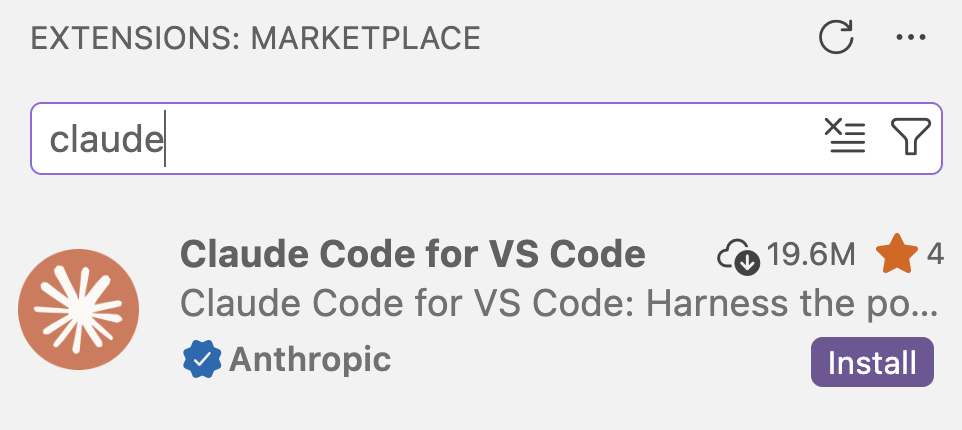

---------

<hr style="height:1pt; visibility:hidden;" />

## Overview

Positron is a new IDE (Integrated Development Environment) created by Posit,
the company behind RStudio.
It's really an **alternative to RStudio** --- and if you're currently using RStudio,
it's worth considering switching to Positron for a few reasons:

1. Positron, not RStudio, will be the main focus of development for Posit moving forward.
2. In RStudio, Posit's AI coding assistant (Posit Assistant) can exclusively
   be used with a paid Posit AI subscription;
   while in Positron, it can be used with a GitHub login or with an API key^[
   Moreover, in Positron, you can use the Claude Code extension just like in VS Code,
   which is not possible in RStudio.].
3. _If you're also using VS Code_: it is built on VS Code and extremely similar to it^[
   But with panels for Plots, your Environment, a Console, and so on, like you're used to from RStudio.].
4. _If you're also using Python_: Positron has much better support for Python than RStudio.

So, if you'd like to experiment with using in-editor AI while coding in R during and
after this workshop, Positron will be the way to go.
Here, we'll install Positron and set up "Posit Assistant" for AI assistance in R.

## Installing Positron

::: {.callout-warning collapse="true"}
#### If you have an OSU-managed computer _(Click to expand)_

If you have an OSU-managed computer, whether you can (easily) install Positron
depends on your operating system and whether you have local administrative privileges:

|  | Have administrative privileges | No administrative privileges |
|-------|------------------------|------------------|
| **Windows** | ✅  | ❌ (Contact the IT Service Desk) |
| **Mac** | ✅  | ✅ ^[But you should install it in your personal, not system-wide, Applications folder.] |

: {.striped .hover tbl-colwidths="[20, 40, 40]"}

<hr style="height:1pt; visibility:hidden;" />

So, if you have a Windows OSU-managed computer _and_ no local administrative privileges,
you will not be able to follow the below instructions.
:::

1. Go to the [Positron download page](https://positron.posit.co/download.html)
   and check the box to accept the license agreement.

2. Download the latest release for your operating system:
   - **Mac**: Look for the `.dmg` file (Intel or Apple Silicon)
   - **Windows**: Look for the `.exe` installer
   - **Linux**: Look for the `.deb` or `.rpm` file depending on your distribution

3. Install Positron:
   - **Mac**: Open the `.dmg` file and drag Positron to your Applications folder.
     - If you have a personal computer or an OSU computer with local administrative privileges,
       you can use the system-wide (standard) Applications folder. 
     - If you have an OSU-managed computer without local administrative privileges,
       you should use your personal Applications folder in your Home folder.
   - **Windows**: Run the `.exe` installer and follow the prompts
   - **Linux**: Use your package manager to install the downloaded file

4. Open the program!

## Setting up Posit Assistant

Posit Assistant is Positron's built-in AI coding assistant,
designed specifically for data analysis workflows.
Among other neat features,
it has access to your R/Python session and can see your data frames and variables
out of the box.

Posit has its own paid AI service, but fortunately,
there are many ways to authenticate with Posit Assistant in Positron (unlike in RStudio).
For us, it makes sense to authenticate with GitHub Copilot and/or
the OSU LiteLLM API key.

::: {.callout-tip appearance="simple"}
Unlike with VS Code, we will do this set up on your own computer, not on OSC.
The configuration will carry over to OSC, though.
:::

### Install the Posit Assistant extension

::: {.columns}

::: {.column width="45%"}

1. Open the **Extensions** view in Positron by clicking the Extensions icon in
   the Activity Bar (the narrow, leftmost sidebar).

2. In the search box, start typing "**posit assistant**".

3. Click **Install** on the "**Posit Assistant**" extension by Posit.

:::

::: {.column width="54%"}

{fig-align="center" width="20%" .lightbox fig-alt="Screenshot of the Positron Extensions view showing the Posit Assistant extension."}

{fig-align="center" width="90%" .lightbox fig-alt="Screenshot of the Positron Extensions view showing the Posit Assistant extension."}

:::

:::

### Authentication via the OSU LiteLLM API

In this workshop,
the recommended approach is to use the same OSU LiteLLM API key we used for
Claude Code in VS Code, as it's approved for use with institutional data,
and easy to set up.

::: {.columns}
::: {.column width="70%"}

1. Click on the newly added **Posit Assistant icon** in Positron's Activity Bar
   (the narrow bar on the far left):

2. It should show the following --- click "Help me set it up" and then "Configure LLM providers:"

:::
::: {.column width="30%"}

{fig-align="center" width="30%" .lightbox fig-alt="Posit Assistant icon in the Activity Bar"}

:::
:::

::: {.columns}
::: {.column width="45%"}
{fig-align="center" width="90%" .lightbox fig-alt="Screenshot of the Posit Assistant panel showing the Configure LLM providers button."}
:::
::: {.column width="45%"}
{fig-align="center" width="90%" .lightbox fig-alt="Screenshot of the Posit Assistant panel showing the Configure LLM providers button."}
:::
:::

3. At the top, select **Custom Provider** from the list of providers, and enter:
   
   - **API Key**: Use the API key from the `~/claude/settings.json` file at OSC,
     or a key you obtained from <https://go.osu.edu/api-fluency>.
   - **Base URL**: `https://litellm.cloud.osu.edu`
   - Then, click **Sign in**.

   {fig-align="center" width="60%" .lightbox fig-alt="Screenshot of the Posit Assistant panel showing the Configure LLM providers button."}

4. If it worked, the assistant panel should now show:

   {fig-align="center" width="40%" .lightbox fig-alt="Screenshot of the Posit Assistant panel showing the Configure LLM providers button."}

5. In the bottom-right of the prompt box, click Select Model:

   {fig-align="center" width="70%" .lightbox fig-alt="Screenshot of the Posit Assistant panel showing the Configure LLM providers button."}

6. The models you can access via the API key are available under
   "**OpenAI Compatible**" (the first option in the list) ---
   click "More models":

   {fig-align="center" width="35%" .lightbox fig-alt="Screenshot of the Posit Assistant panel showing the Configure LLM providers button."}

7. In the (long!) dropdown list, select `claude-opus-4-6`.
   Then, the prompt should look something like this:

   {fig-align="center" width="75%" .lightbox fig-alt="Screenshot of the Posit Assistant panel showing the model selection dropdown."}

::: {.callout-warning}
#### Model compatibility

You don't need to stick to `claude-opus-4-6` all the time,
and should feel free to experiment with other models later.
However, not all models available through the OSU LiteLLM service may work with
Posit Assistant's Custom Provider.
If you get an "**internal error**" when trying to use the Posit Assistant,
switch to a different model and try again.
:::

### Authentication via GitHub

If you've done the previous setup with the OSU LiteLLM API key,
setting up authentication via GitHub is not required.
However, like in VS Code, GitHub Copilot will provide inline code completions^[
But in this case, does so via Posit Assistant rather than its own extension.],
which access via the API key does not. 

::: {.columns}
::: {.column width="70%"}

1. If it's not open already, click on the **Posit Assistant icon** in Positron's
   Activity Bar (the narrow bar on the far left):

2. Assuming you did the setup above, Posit Assistant will already be activated
   and won't automatically prompt you to authenticate.
   If that's the case, click the cog wheel  icon at the top of the Posit Assistant
   panel and select **Configure LLM providers**^[
   This window can also be invoked via the Command Palette (<kbd>Ctrl/⌘</kbd>+<kbd>Shift</kbd>+<kbd>P</kbd>) and typing "_**Configure**_", 
   or by clicking on the "Person icon" above the cog wheel way at the bottom
   of the Activity Bar.
   In both of those contexts, it's listed as "**Configure Language Model providers**".].

:::
::: {.column width="30%"}

{fig-align="center" width="30%" .lightbox fig-alt="Posit Assistant icon in the Activity Bar"}
:::
:::

3. Select the provider "GitHub Copilot" and click "**Sign in**"
   (keep the default selection of `OAuth` for **Authentication**):

   {fig-align="center" width="55%" .lightbox fig-alt="Screenshot of the Posit Assistant panel showing the Configure LLM providers button."}

4. A browser window will open, asking you to authorize Posit Assistant to access your GitHub account.
   Log in and authorize as requested.

5. Done! Now, when clicking on the model selection indicator in the Posit Assistant prompt,
   you should see models listed under a GitHub Copilot section header:

   {fig-align="center" width="27%" .lightbox fig-alt="Screenshot of the Posit Assistant panel showing the model selection dropdown."}

### Testing Posit Assistant

::: callout-important
#### This section assumes you have R installed on your computer.

You don't really have to do so for this workshop, but can install R in Windows
using [this `.exe` file](https://cran.r-project.org/bin/windows/base/release.htm)
or Mac using [this `.pkg` file](https://cran.r-project.org/bin/macosx/R-latest.pkg).
Or, if you have an OSU-managed computer, via the Software Center (Windows) or
Ohio State Application Self Service (Mac).
:::

Let's verify that it works (with either a model via the API key or GitHub Copilot,
depending on what you set up):

1. The "CONSOLE" tab in the bottom Positron panel should be open.
   This may be an R console, but it could also be a Python console.
   
   ::: {.callout-warning collapse="true"}
   #### If you're seeing a Python console instead of R _(Click to expand)_

   - In the top-right corner of the Positron window, you should see something like this:

     {fig-align="center" width="40%" .lightbox fig-alt="Screenshot of the Positron console panel showing a Python console."}

   - Click on the Python indicator, and then select **New Console Session**:

     {fig-align="center" width="70%" .lightbox fig-alt="Screenshot of the Positron console panel showing the New Console Session button."}

   - Switch to R by selecting an appropriate R version:

     {fig-align="center" width="70%" .lightbox fig-alt="Screenshot of the Positron console panel showing the Switch to R Console option."}

   - When done, you should see this in the top-right instead...

     {fig-align="center" width="40%" .lightbox fig-alt="Screenshot of the Positron console panel showing an R console."}

     ...and your console should have switched to R as well.
   :::

2. In the R console, create a simple data frame:

   ```r
   df <- data.frame(x = 1:10, y = rnorm(10))
   ```

3. In the Posit Assistant panel, try asking:

   > Create a scatter plot of x vs y from df

3. Posit Assistant should generate code for a plot and ask for permission to run it:
   click **Allow**.

   {fig-align="center" width="70%" .lightbox fig-alt="Screenshot of the Posit Assistant panel showing a prompt and generated code for a scatter plot."}

4. It produces the plot and shows it in its own panel,
   along with some neat suggestions for next steps!
   _The plot should also appear in the Plots panel, like in RStudio,_
   _since it was actually generated on your computer with R code._

   {fig-align="center" width="80%" .lightbox fig-alt="Screenshot of the Posit Assistant panel showing a prompt and generated code for a scatter plot."}

::: {.callout-tip appearance="simple"}
Posit Assistant can see your R session's variables, including data frames.
This means you can ask questions about your data without having to explicitly
describe it — the assistant already knows what's in your environment!
:::

## Connecting to OSC compute nodes

Positron, being built on VS Code, can connect to remote systems like OSC using the same SSH configuration.
If you've already set up VS Code to connect to OSC following [the earlier setup instructions](05-setup.qmd#setting-up-the-osc-connection-in-vs-code),
**your SSH configuration will automatically work in Positron too**.

::: {.callout-important collapse="true"}
#### Haven't configured the SSH connection in VS Code?

If you haven't set up the SSH connection to OSC in VS Code (or any other editor):

You'll need to do so before you can connect from Positron.
Follow the instructions in the [VS Code setup guide](05-setup.qmd#setting-up-the-osc-connection-in-vs-code).

Or, if you don't want to set this up in VS Code at all,
you can start at [Configure the connection](05-setup.qmd#configure-the-osc-connection)
**_and instead do this in Positron_** (it's identical!).
:::

### Connecting to OSC from Positron

Assuming the SSH configuration is in place:

1. Open the **Command Palette**
   (<kbd>Ctrl/⌘</kbd>+<kbd>Shift</kbd>+<kbd>P</kbd> or `View` > `Command Palette`)
   and type "_**SSH connect**_".

2. Select `Remote-SSH: Connect to Host...` and then choose `osc-cardinal-compute`:

   {fig-align="center" width="50%" .lightbox fig-alt="Screenshot of the VS Code window showing the SSH connection options."}

3. A new Positron window will open and connect to OSC.
   This may take 30 seconds or more while a compute node is being allocated.

4. Once connected, you may see a pop-up asking whether you "trust the authors" —
   click **Trust and Continue**.

::: {.callout-tip}
#### Quick reconnect

Like in VS Code, after connecting once,
the folder will appear in Positron's "Recent" list on the welcome screen,
making it easy to reconnect with a single click in future sessions.
:::

### Loading R at OSC

R is installed but not automatically loaded at OSC.
The easiest way to make sure that Positron will find R when it connects to OSC
is by adding the R module to your Bash settings file (`~/.bashrc`):

1. Open a **terminal** in Positron (e.g., `Terminal` > `New Terminal`).

2. Add a `module load` command to load R to your `~/.bashrc` file:

   ```bash
   echo 'module load gcc/12.3.0 R/4.5.0' >> ~/.bashrc
   ```

3. Reload Positron:
   Open the **Command Palette**
   (<kbd>Ctrl/⌘</kbd>+<kbd>Shift</kbd>+<kbd>P</kbd> or `View` > `Command Palette`)
   and start typing "_Reload Window_", then select "**Developer: Reload Window**".

4. Positron should automatically start R in the console.

::: callout-warning
#### This isn't a permanent solution to load R at OSC
Adding this `module load` command to your Bash settings file is not a permanent solution,
because over time, there may be changes in the version(s) of R available on OSC
and/or that you personally want to use (usually, multiple versions of R are available).
On the plus side, this command does currently work on all three OSC clusters,
since they have the same R modules.
:::

### Installing the Posit Assistant extension at OSC

The Posit Assistant does need to be separately installed at OSC:
like before, open the Extensions view, find Posit Assistant,
and click **"Install in SSH: osc-cardinal-compute"**.

{fig-align="center" width="50%" .lightbox fig-alt="Screenshot of the Posit Assistant extension in the Extensions view."}

Otherwise, the Posit AI assistant will work the same way when connected to OSC
as it does on your local computer, and you shouldn't need any additional setup!

### Open a folder

Positron really wants you to open a specific folder ---
you may have already seen it prompt you early during this configuration process.

At OSC, just like with VS Code,
you should connect to the `/fs/scratch/PAS3454/people/<user>` folder,
where `<user>` is your OSC username.
In the Explorer, click on the "Open Folder" button and enter this path.

{fig-align="center" width="50%" .lightbox fig-alt="Screenshot of the Positron Explorer view showing the Open Folder button."}

## Appendix: Setting up Claude Code (optional)

Claude Code works in Positron just like it does in VS Code with an API key.
Since you've already set up Claude Code for VS Code and have a `~/claude/settings.json` file,
the setup in Positron is straightforward.

You may consider doing this if you're used to Claude Code or prefer it over
Posit Assistant for certain tasks.
Otherwise, you can skip this section and just use Posit Assistant ---
recall that you can use Posit Assistant with the OSU LiteLLM API key,
which is also approved for institutional data.

::: {.callout-warning appearance="simple"}
The instructions below assume you're at OSC,
where you have a `~/.claude/settings.json` file with your API key.
Adjusting this for your personal computer is pretty straightforward, though:
you'll need to download the `settings.json` file from OSC and put it at the same
location on your own computer (`~/.claude/settings.json`).
:::

### Install the Claude Code extension

1. Open the **Extensions** view in Positron:
   - Click the Extensions icon in the Activity Bar (the leftmost sidebar), or
   - Press <kbd>Ctrl/⌘</kbd>+<kbd>Shift</kbd>+<kbd>X</kbd>

2. In the search box, type "**claude code**".

3. Find the "**Claude Code for VS Code**"^[
   Yes, "for VS Code", not "for Positron".
   Positron isn't just similar to VS Code but is really a variant ("fork") of it.]
   extension by Anthropic and click **Install**:

   {fig-align="center" width="50%"}

### Configure authentication

Since you already have a `~/claude/settings.json` file from your earlier VS Code setup,
Claude Code should automatically pick it up and authenticate:

1. After installing the extension, look for a new **CLAUDE CODE** tab in the sidebar
   (you may need to widen the sidebar to see both "CHAT" and "CLAUDE CODE" tabs).

2. Click on the **CLAUDE CODE** tab.

3. You should briefly see authentication messages, then the interface should load automatically.

4. Once loaded, you'll see a prompt box similar to Posit Assistant's interface.

<!------

Additional notes:
- The Claude Code extension can't see your R session by default, unlike Posit Assistant.
  But you can connect using `btw::btw_mcp_session()`.
- llmcoder can hook up to free models and Ollama: https://r-posts.com/rstudio-ai-that-doesnt-cost-a-penny-llmcoder-vs-posit-ai-assistant/

------->
