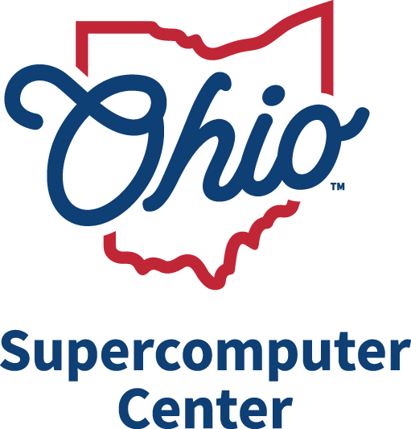
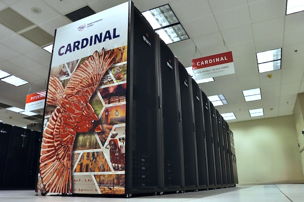
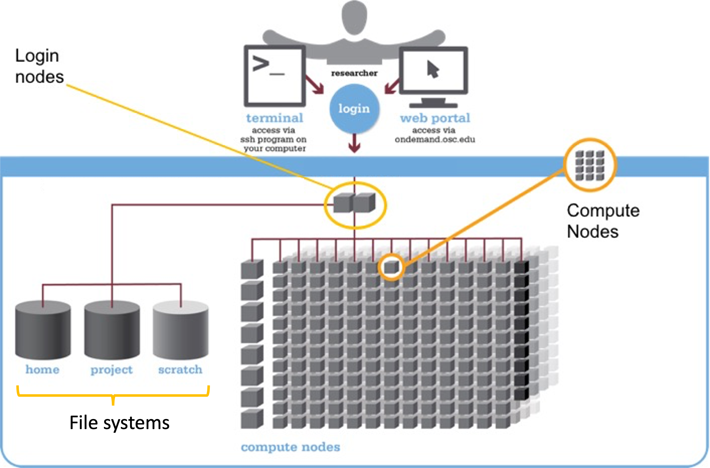
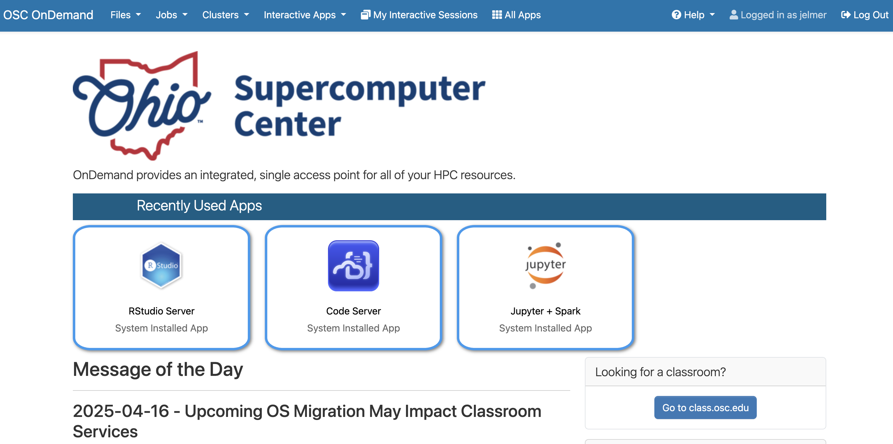
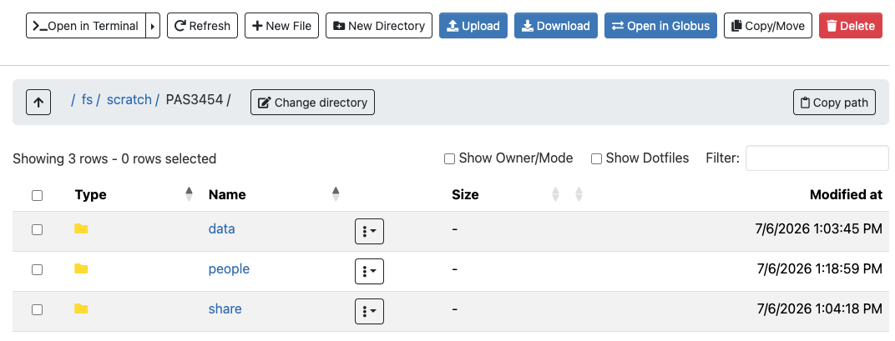
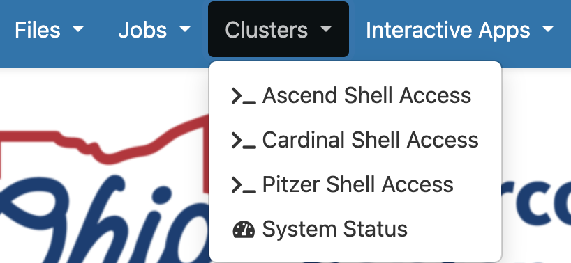
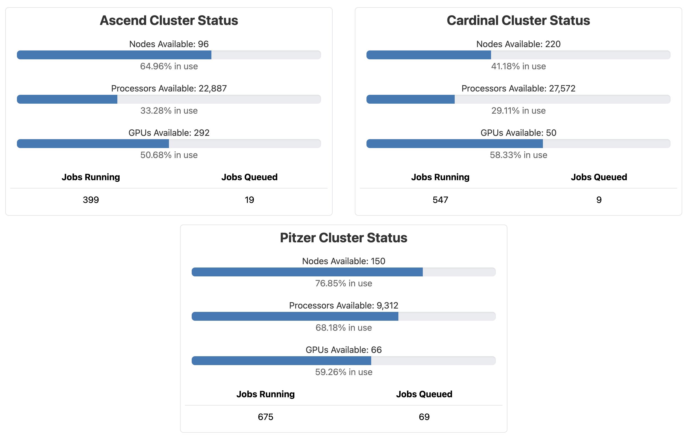

---------

{fig-align="center" width="25%" fig-alt="The Ohio Supercomputer Center logo." .lightbox}

## Introduction

This part introduces _high-performance computing_
and the **Ohio Supercomputer Center (OSC)**. You will learn:

- What a supercomputer is and why they are useful
- What resources the Ohio Supercomputer Center (OSC) provides
- How to access OSC resources through its OnDemand webportal

## High-performance computing

A **supercomputer** (also known as a "compute cluster" or simply a "**cluster**")
consists of many computers that are connected by a high-speed network,
and that can be _accessed remotely_ by its users.

Supercomputers provide high-performance computing (**HPC**) resources,
which consists of two main aspects:

- **Compute**: computing power to run your data processing and analysis
- **Storage**: storage space for your data and results

{fig-align="center" width="50%" fig-alt="A photo of the Cardinal OSC cluster" .lightbox}

Here are some possible reasons to use a supercomputer instead of your own computer:

- Your analysis takes a long time to run or needs high computational power.
- You need to run an analysis many times.
- Your analysis requires software available only for the Linux operating system, while you have Windows.
- You need to store a _lot_ of data.

**When you're working with omics data, many of these reasons typically apply.**

## The Ohio Supercomputer Center (OSC)

The Ohio Supercomputer Center (OSC) is a facility provided by the state of Ohio ---
it's not part of OSU.
It has several supercomputers, lots of storage space,
and an excellent infrastructure for accessing these resources.

Access to OSC's compute and storage goes through **OSC "Projects"**:

- A project can be tied to a research project or lab, or be educational like this workshop's project (`PAS3454`).
- Each project has a budget in terms of "compute hours" and storage space^[
  Though we don't have to pay anything for educational projects like this one!].
- A user can be a member of multiple projects.

::: {.callout-note collapse="true"}
#### OSC websites (_Click to expand_)

OSC has **three main websites** ---
in this workshop, we will almost exclusively use the first:

- **<https://ondemand.osc.edu>**: A web portal to use OSC resources through your browser (*login needed*).
- <https://my.osc.edu>: Account and project management (*login needed*).
- <https://osc.edu>: General website with information about the supercomputers, installed software, and usage.

:::

## The structure of a supercomputer center

### Terminology

Let's start with some (super)computing terminology,
going from smaller to bigger things:

- **Node**\
  A single computer that is a part of a supercomputer.
- **Supercomputer / Cluster**\
  A collection of connected computers.
  OSC currently has three: "Ascend", "Cardinal", and "Pitzer".
- **Supercomputer Center**\
  A facility like OSC that has one or more supercomputers.

### Supercomputer components

We can think of a supercomputer as having the following main parts:

- **File Systems**: Where files are stored (shared between the various OSC supercomputers!)
- Nodes, with a key distinction between:
  - **Login Nodes**: The computers everyone shares after logging in (only a handful per supercomputer)
  - **Compute Nodes**: The computers you can reserve to run your analyses (many per supercomputer)

{fig-align="center" width="85%" fig-alt="A diagram showing the structure of a supercomputer with three main components: file systems, login nodes, and compute nodes" .lightbox}

#### File systems

OSC has several distinct file systems, and it is important to know which one to use for which purpose:

| File system | Located at | Main purpose | How many
|------|-------|-----------------|---|
| **Project**     | `/fs/ess/`   | OSC's main project-based storage | One per OSC Project
| **Scratch**     | `/fs/scratch/`    | Additional, temporary project-based storage | One per OSC Project
| **Home**        | `/users/`         | General, _personal_ files | One per user

: {.striped .hover tbl-colwidths="[15, 20, 40, 35]"}

During the workshop, we'll work in the scratch folder of the workshop's OSC Project
`PAS3454`, located at `/fs/scratch/PAS3454`.

::: callout-tip
#### Key file system terminology (applies to any computer)

- A **path** is the location of a file or folder on a computer.
- A **directory** (or "dir" for short) is simply another word for a folder.
:::

{fig-align="center" width="40%" .lightbox fig-alt="A diagram showing paths on OSC and navigating upwards with relative paths"}

::: callout-warning
#### Home directory clarifications and pitfalls

Many new OSC users are confused about the Home directory, so let's clarify a few things:

- Even though a project number is part of the path to your Home directory
  (e.g., `/users/PAS3454/jane`)
  this is merely an OSC naming convention and **your Home directory is not tied to any OSC Project.**
  Thefore, your Home directory will remain the same even if you are, say, removed from a project.

- **By default, you will be placed in your Home directory when you --e.g.-- log in to OSC.**
  But this is typically not where you want to be when working with data and running analyses.
  During this workshop, for example, you should be within `/fs/scratch/PAS3454/` ---
  we'll show you how to navigate there.

------

- Avoid storing research project file in your Home dir:
  it has limited space and is harder to access by collaborators.

- Your Home dir will contain some automatically generated files and those
  should generally not be deleted!
:::

#### Login vs. compute nodes

**Login nodes** are an initial landing spot for everyone who logs in to a supercomputer.
Each supercomputer only has a handful of login nodes,
and they are shared among everyone and cannot be reserved for exclusive usage.
Login nodes are meant for things like organizing files and creating scripts
for compute jobs, and ***not*** **for serious computing**.

**Compute nodes** are where data processing and analysis is done.
You can only use compute nodes after putting in a **request for resources**
(a "compute job").
A scheduling program called **Slurm** then assigns the requested resources:
for example, you may get exclusive access to a specific compute node for two hours.

::: callout-tip
#### Key take-home messages so far

- The distinction between login nodes and compute nodes
- The distinction between your Home folder and folders associated with OSC Projects
:::

## OSC OnDemand

The OSC OnDemand web portal is a great resource that allows you to access OSC resources
within a web browser.

 **Go to <https://ondemand.osc.edu> and log in** (use the boxes on the left-hand side).
Once logged in, you should see a landing page similar to the one below:

{fig-align="center" width="95%" fig-alt="A screenshot of the OSC OnDemand landing page" .lightbox}

We will now go through some of the dropdown menus in the **blue bar along the top**:

### Files menu

Hovering over the **Files** dropdown menu gives a list of folders you can access.
If your account is brand new and was created after you were added to `PAS3454`,
you should only see three folders listed:

1.  A **Home** folder (starts with `/users/`)
2.  The `PAS3454` project's "**project**" folder (`/fs/ess/PAS3454`)
3.  The `PAS3454` project's "**scratch**" folder (`/fs/scratch/PAS3454`) 

::: {.callout-note appearance="simple"}
As mentioned above: you will only ever have one Home folder at OSC,
but for every additional project you are a member of,
you will usually see additional `/fs/ess` and `/fs/scratch` folders appear.
:::

 **Click on folder `/fs/scratch/PAS3454`**.
Once there, you should see the folders and files present at the selected location,
and can click on folders to explore their contents:

{fig-align="center" width="95%" fig-alt="A screenshot of the OSC OnDemand file browser." .lightbox}

This interface is **much like your own computer's file browser**,
so you can also create, delete, move and copy files and folders,
and even upload (from your computer to OSC) and download (from OSC to your computer) files.

 **Create a personal folder** inside `/fs/scratch/PAS3454/people`:

1. Click on the `people` folder
2. Click the "New Directory" button at the top
3. Give the new folder the **exact same name** as your OSC username.
   (If you forgot your username, you can see it in the top-right corner of the OnDemand webpage.)
4. Click on your new folder and within it, create one more folder: `pre` (short for "pre-workshop").

### Interactive Apps menu

With the **Interactive Apps** dropdown menu,
you can access programs with Graphical User Interfaces (**GUI**s; point-and-click interfaces),
such as RStudio, Jupyter Notebook, VS Code, and many more.

::: {.callout-note collapse="true"}
### Cluster usage info in the Clusters menu _(Click to expand)_

The Clusters menu gives access to a Unix Shell on each cluster,
contains a page with information about installed software,
and provides a page with live information about cluster usage.
Here, we'll just look at the latter.

In the "**Clusters**" dropdown menu, click on the item at the bottom, "**`System Status`**":

{fig-align="center" width="40%" fig-alt="A screenshot of the options in the OSC OnDemand Clusters dropdown menu." .lightbox}

This page shows an overview of the live, current usage of the two clusters ---
for now,
this should mostly just give you a good idea of the scale of the supercomputer center^[
This information can also be useful to learn which cluster currently has more available nodes,
and what the sizes are of the "queues", which contain jobs waiting to start].

{fig-align="center" width="90%" fig-alt="A screenshot of the OSC Ondemand System Status page showing live cluster usage." .lightbox}
:::

## VS Code

VS Code is basically a **fancy text editor**.
Its full name is Visual Studio Code, and it's called "Code Server" at OSC.

To emphasize the additional functionality relative to basic text editors like Notepad and TextEdit,
editors like VS Code are also referred to as **IDEs**: Integrated Development Environments.
The RStudio program is another good example of an IDE ---
and like RStudio is an IDE for R, VS Code will be our IDE for shell (and other) code.

In this session, we will use VS Code to practice with Unix shell basics and scripting.

### Starting VS Code at OSC

- In the Interactive Apps dropdown menu, near the bottom, click `Code Server`.

- Interactive Apps like VS Code and RStudio **run on compute nodes** (not login nodes).
  Because compute nodes always need to be "reserved",
  we have to fill out a form and specify the following details:
  - The **Cluster** we want to use: `Pitzer`
  - The **Account**, the OSC Project to be billed for the compute node usage: `PAS3454`
  - The **Number of hours** we want to make a reservation for: `2`
  - The **Working Directory** (starting location -- replace `<user>` with your OSC username):
    `/fs/scratch/PAS3454/people/<user>/pre`
  - The **App Code Server version**: `4.8.3` (the only available option)

  ::: {.callout-warning appearance="simple"}
  When selecting the Working Directory, don't get confused by the "Select Path" button.
  This is an _alternative_ to typing the path in the text box,
  not a way to confirm the path you typed.
  :::

- Click `Launch` and you'll be sent to the _My Interactive Sessions_ page
  with a card for your job at the top.

- First, your job may be *Queued* for some seconds
  (i.e., waiting for computing resources to be assigned to it),
  but it should soon switch to *Starting* and then
  be ready for usage (*Running*) in another couple of seconds:

{fig-align="center" width="75%" fig-alt="A screenshot of the OSC OnDemand page shown when the Code Server job has started running." .lightbox}

- Once the blue **Connect to VS Code** button appears,
  click that to open VS Code in a new browser tab.

- When VS Code opens, you may get a pop-up similar to this ---
  click "Yes" and check the box:

{fig-align="center" width="60%" fig-alt="A screenshot of a popup you may get when first opening a folder in VS Code." .lightbox}

- You'll also see a Welcome document ---
  you don't have to go through any steps suggested there.

_Congratulations: you have started your first compute job at OSC!_ 🥳

### Open a Terminal with a Unix shell

In VS Code, **open a terminal** by clicking    > `Terminal` > `New Terminal`.
We'll use this to practice with Unix shell commands next.

