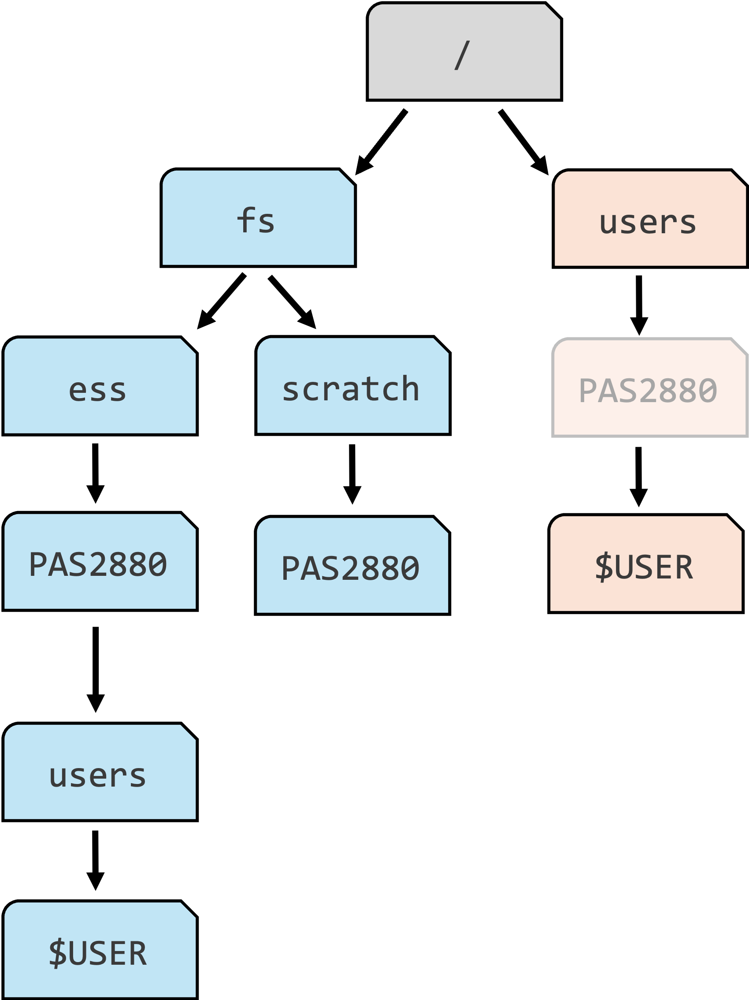
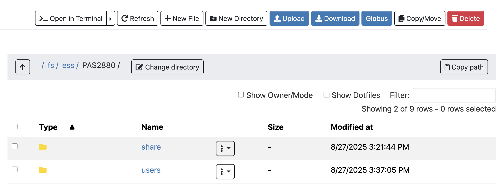
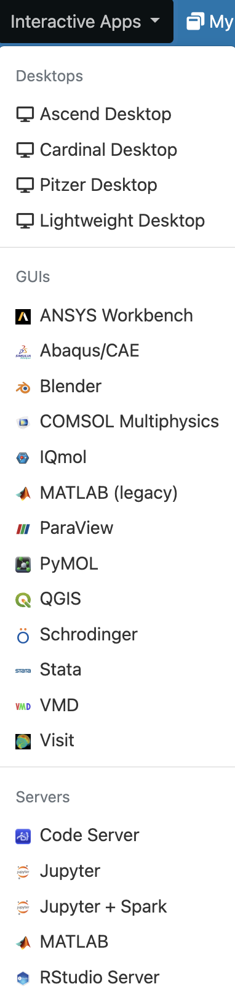

---------

::: {.callout-caution appearance="simple"}
**_This page is still subject to change_**
:::

{fig-align="center" width="25%" fig-alt="The Ohio Supercomputer Center logo." .lightbox}

## Introduction

This session introduces high-performance computing 
and the Ohio Supercomputer Center (OSC). You will learn:

- What a supercomputer is and why they are useful
- What resources the Ohio Supercomputer Center (OSC) provides
- How to access OSC resources through its OnDemand webportal

## High-performance computing

A **supercomputer** (also known as a "compute cluster" or simply a "**cluster**")
consists of many computers that are connected by a high-speed network,
and that can be _accessed remotely_ by its users.

Supercomputers provide high-performance computing (**HPC**) resources,
which consists of two main aspects:

- **Compute**: computing power to run your data processing and analysis
- **Storage**: space for (long-term) storage of your data and results

For a visual reference, this is what Cardinal, one of the OSC supercomputers, looks like:

{fig-align="center" width="50%" fig-alt="A photo of the Cardinal OSC cluster" .lightbox}

Here are some possible reasons to use a supercomputer instead of your own laptop or desktop:

- Your analysis takes a long time to run or needs high computational power.
- You need to run an analysis many times.
- You need to store a lot of data.
- Your analysis requires software available only for the Linux operating system, while you have Windows.

**When you're working with omics data, many of these reasons typically apply.**
This can make it hard or impossible to run your analyses on your personal workstation,
and supercomputers provide a solution.

## The Ohio Supercomputer Center (OSC)

The Ohio Supercomputer Center (OSC) is a facility provided by the state of Ohio.
It has several supercomputers, lots of storage space,
and an excellent infrastructure for accessing these resources.

Access to OSC's compute and storage goes through **OSC "Projects"**:

- A project can be tied to a research project or lab, or be educational like this workshop's project, `PAS3454`.
- Each project has a budget in terms of "compute hours" and storage space^[
  Though we don't have to pay anything for educational projects like this one!].
- As a user, it's possible to be a member of multiple different projects.

::: {.callout-note}
#### OSC websites

OSC has **three main websites** ---
in this workshop, we will almost exclusively use the first:

- **<https://ondemand.osc.edu>**: A web portal to use OSC resources through your browser (*login needed*).
- <https://my.osc.edu>: Account and project management (*login needed*).
- <https://osc.edu>: General website with information about the supercomputers, installed software, and usage.

:::

## The structure of a supercomputer center

### Terminology

Let's start with some (super)computing terminology,
going from smaller things to bigger things:

- **Node**\
  A single computer that is a part of a supercomputer.
- **Supercomputer / Cluster**\
  A collection of connected computers.
  OSC currently has three: "Ascend", "Cardinal", and "Pitzer".
- **Supercomputer Center**\
  A facility like OSC that has one or more supercomputers.

### Supercomputer components

We can think of a supercomputer as having three main parts:

- **File Systems**: Where files are stored (these are shared between the OSC supercomputers!)
- **Login Nodes**: The handful of computers everyone shares after logging in
- **Compute Nodes**: The many computers you can reserve to run your analyses

{fig-align="center" width="85%" fig-alt="A diagram showing the structure of a supercomputer with three main components: file systems, login nodes, and compute nodes" .lightbox}

#### File systems

OSC has several distinct file systems:

| File system | Located at | Main purpose | How many
|------|-------|-----------------|---|
| **Project**     | `/fs/ess/`   | OSC's main data storage location | One per user
| **Scratch**     | `/fs/scratch/`    | Additional, temporary storage | One per OSC Project
| **Home**        | `/users/`         | General, _personal_ files | One per OSC Project

: {.striped .hover tbl-colwidths="[15, 15, 70]"}

During the workshop, we'll work in the Scratch folder of the workshop's OSC Project
`PAS3454`, which is located at `/fs/scratch/PAS3454`.

Key file system terminology:

- A **path** is the location of a file or folder on a computer.
- A **directory** (or "dir" for short) is simply another word for a folder.

{fig-align="center" width="40%" .lightbox fig-alt="A diagram showing paths on OSC and navigating upwards with relative paths"}

::: callout-warning
#### Home directory clarifications and pitfalls

- Even though a project is listed in the path to your Home directory,
  this is merely an OSC naming convention and **your Home directory is not tied to any OSC Project.**

- You will only ever have one Home directory and its location will not change,
  even if the project that is listed in the path --for example-- ceases to exist.

- **By default, you will be placed in your Home directory when you --e.g.-- log in to OSC.**
  **But this is typically not where you want to be when working with data and running analyses.**

- Avoid storing research project file in your Home dir:
  it has limited storage and is harder to access by collaborators.

- Your Home dir may contain all sorts of automatically generated files and those
  should generally not be deleted!
:::

#### Login Nodes

Login nodes are an initial landing spot for everyone who logs in to a supercomputer.
Each supercomputer only has a handful of login nodes,
and they are shared among everyone, and cannot be reserved for exclusive usage.

Therefore, login nodes are meant only for things like organizing files and
creating scripts for compute jobs.
They are ***not*** **meant for serious computing** -- in other words,
they don't provide compute, which is the function of compute nodes.

#### Compute Nodes

Data processing and analysis is done on compute nodes.
You can only use compute nodes after putting in a **request for compute resources**
(a "compute job").

A *job scheduler* program called _Slurm_,
which you'll learn more about shortly, then assigns the requested resources:
for example, you may get exclusive access to a specific compute node for two hours.

## OSC OnDemand

The OSC OnDemand web portal is an amazing recourse that allows you to use a
web browser to access OSC resources. For example, it offers access to:

- A **file browser/explorer**
- A **Unix shell**
- "**Interactive Apps**": programs such as RStudio and VS Code

-----

 **Go to <https://ondemand.osc.edu> and log in** (use the boxes on the left-hand side).
Once logged in, you should see a landing page similar to the one below:

{fig-align="center" width="95%" fig-alt="A screenshot of the OSC OnDemand landing page" .lightbox}

We will now go through some of the dropdown menus in the **blue bar along the top**.

### Files menu

Hovering over the **Files** dropdown menu gives a list of folders that you have access to.
If your account is brand new, and you were added to `PAS3454`,
you should only see three folders listed:

1.  A **Home** folder (starts with `/users/`)
2.  The `PAS3454` project's "**project**" folder (`/fs/ess/PAS3454`)
3.  The `PAS3454` project's "**scratch**" folder (`/fs/scratch/PAS3454`) 

You will only ever have one Home folder at OSC,
but for every additional project you are a member of,
you will usually see additional `/fs/ess` and `/fs/scratch` folders appear.

-----

 **Click on folder `/fs/scratch/PAS3454`**.
Once there, you should see the folders and files present at the selected location,
and can click on folders to explore their contents:

{fig-align="center" width="95%" fig-alt="A screenshot of the OSC OnDemand file browser." .lightbox}

This interface is **much like the file browser on your own computer**, so you can also create, delete, move and copy files and folders, and even upload (from your computer to OSC) and download (from OSC your computer) files^[Though this is not meant for large (\>1 GB) transfers. Different methods are available --- we'll talk about those later on.] --- see the buttons across the top.

---- 

 **Create a personal folder** inside `/fs/ess/PAS3454/people`:

1. Click on the `people` folder
2. Click the "New Directory" (_**directory -or dir for short- is another word for folder**_)
   at the top
3. Give the new folder the **exact same name** as your OSC username.
   If you forgot your username, you can see it in the top-right corner of the OnDemand webpage.
4. Click on the new folder and within it, create one more folder: `pre-workshop`.

### Interactive Apps menu

You can access programs with Graphical User Interfaces (**GUI**s; point-and-click interfaces)
via the **Interactive Apps** dropdown menu:

{fig-align="center" width="20%" fig-alt="A screenshot of the options in the OSC Ondemand Interactive Apps dropdown menu." .lightbox}

Shortly, we'll start using the VS Code text editor,
which is listed here as `Code Server`.

### Clusters menu

This menu gives access to a Unix Shell on each cluster,
contains a page with information about installed software,
and provides a page with live information about cluster usage.
Here, we'll just look at the latter.

In the "**Clusters**" dropdown menu, click on the item at the bottom, "**`System Status`**":

{fig-align="center" width="40%" fig-alt="A screenshot of the options in the OSC OnDemand Clusters dropdown menu." .lightbox}

This page shows an overview of the live, current usage of the two clusters ---
for now,
this should mostly just give you a good idea of the scale of the supercomputer center^[
This information can also be useful to learn which cluster currently has more available nodes,
and what the sizes are of the "queues", which contain jobs waiting to start].

{fig-align="center" width="90%" fig-alt="A screenshot of the OSC Ondemand System Status page showing live cluster usage." .lightbox}

## Key take-home messages

- The distinction between login nodes and compute nodes
- The distinction between your Home folder and folders associated with OSC Projects

