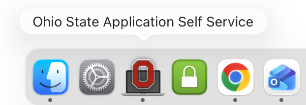
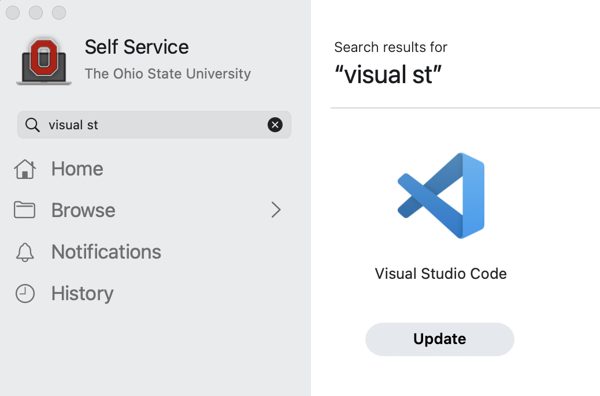

---------

## Overview

In this workshop, we'll use the Visual Studio Code (VS Code) editor for
most hands-on tasks: to write and run code, to connect to OSC, and to deploy agentic AI tools.
This Microsoft program is freely available for anyone and works on Windows, Mac, and Linux computers. 

This brief page will help you to install VS Code on whatever laptop you plan to bring to the workshop.
There are separate instructions for OSU-managed computers and personal computers below.

::: {.callout-note}
#### What about VS Code in the browser via OSC OnDemand?
In the pre-workshop learning session, we used VS Code in our browser via OSC OnDemand.
However, for the workshop itself, we will use VS Code installed on your own laptop.
There are several reasons for this, but the main one is that
we can't use the browser version for the agentic AI tools.
:::

## Installation on an OSU-managed computer

If you are bringing an OSU computer, you may not have the required
"administrative privileges" to install software on your computer the regular way.

However, your computer should then have an OSU application that allows you to install a
selection of approved software, and that selection includes VS Code.

::: {.panel-tabset}
#### Mac

The OSU app is called "**_Ohio State Application Self Service_**".

1. Open this application, which should be pinned in your Dock (otherwise, search for it)
2. In it, start typing "Visual Studio Code" in the little search box on the top left
3. Click the "Install" button that appears below the Visual Studio Code entry

{align="center" width="400px"}

{align="center" width="600px"}

See also [this IT page for general Software Center usage instructions](https://osuitsm.service-now.com/selfservice/kb_view.do?sysparm_article=kb05607).

#### Windows

The OSU app is called "**_Software Center_**".

1. Open this application. For example, you can press the Windows start button
   and start typing "Software Center" in the search box.

2. In it, start typing "Visual Studio Code" in the search box.

3. Click the "Install" button that appears with the Visual Studio Code entry,
   which has the following logo:

{fig-align="center" width="15%"}

See also [this IT page for general Software Center usage instructions](https://osuitsm.service-now.com/selfservice/kb_view.do?sysparm_article=kb07357).

:::

## Installation on a personal computer

Installation is quite straightforward ---
follow the links below for the official VS Code installation instructions for:

- [Windows](https://code.visualstudio.com/docs/setup/windows)
- [Mac](https://code.visualstudio.com/docs/setup/mac)
- [Linux](https://code.visualstudio.com/docs/setup/linux)
